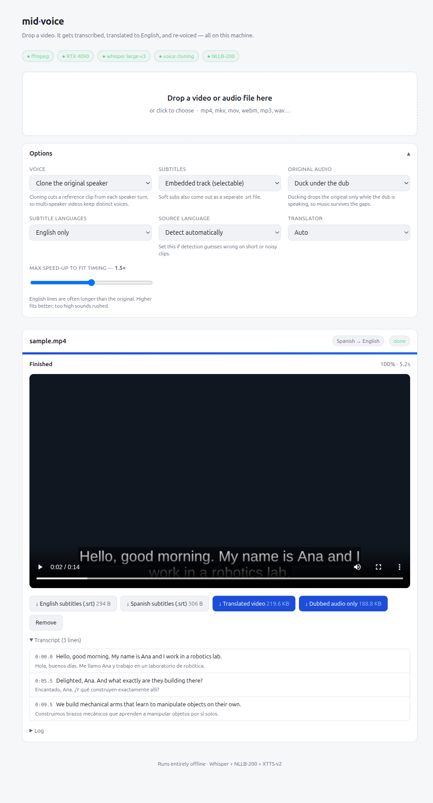

# mid-voice

**Drop a video in your browser, get it back dubbed in English — in a voice that
sounds like the original speaker.** Runs entirely on your own machine. No API
keys, no uploads, no accounts.

[](LICENSE)
[](INSTALL.md)




```
video ──ffmpeg──► audio ──Whisper──► source transcript ──NLLB-200──► English
                                                                        │
                    original audio ◄── dynamic duck ──── XTTS-v2 voice clone
                                              │
                                          ffmpeg mux ──► video.en.mp4 + .srt
```

## Quick start

Needs `ffmpeg`, Python 3.10–3.12, and ideally an NVIDIA GPU.

```bash
git clone https://github.com/devrim/mid-voice.git
cd mid-voice
uv venv --python 3.12
uv pip install -e ".[tts,mt,cuda]"
./run.sh                                # → http://127.0.0.1:7860
```

Full instructions, CPU-only setup, and troubleshooting: **[INSTALL.md](INSTALL.md)**.

The first run downloads ~10 GB of model weights and looks like it's hanging.
Watch the terminal.

## What makes it different

**Speaker-aware cloning without diarization.** Instead of running a diarization
model to separate speakers, mid-voice cuts the voice-clone reference out of the
*original audio at the timeline position of each line*. Whoever was talking at
04:12 conditions the synthesized voice at 04:12. A two-hander keeps two distinct
voices for free, and conditioning latents are cached per speaker turn so
consecutive lines cost nothing extra.

**Dynamic ducking, not a flat mix.** Holding the original at −18 dB for the
whole runtime kills the music and room tone. mid-voice builds a gain envelope
from the dub itself: the original drops only while the dub is speaking and comes
back up in the gaps. Attack is fast, release is slow, so it doesn't pump.

**Timing that survives translation.** English is usually longer than the source.
Each synthesized line is pitch-preserved time-stretched to fit its slot, capped
at a limit you control, and allowed to spill into the following pause rather
than being cut off. Anything that still doesn't fit is reported in the job log
instead of silently truncated.

**Subtitles that respect the format.** Lines wrap at 42 characters, and a
segment too long to display becomes several cues with durations divided by
character count — never one wall of text, never a dropped word.

## Options

| Option | What it does |
|---|---|
| **Voice** | *Clone the original speaker* (XTTS-v2), or *no dub* for subtitles only. |
| **Subtitles** | Off, an embedded selectable track plus a standalone `.srt`, or burned into the picture. Burn-in re-encodes; the others copy the video stream untouched. |
| **Original audio** | *Duck* under the dub (default), *keep audible* for the UN-interpreter sound, or *remove* entirely. |
| **Subtitle languages** | English only, or English plus the source language. |
| **Source language** | Auto-detected; override it when detection guesses wrong on short or noisy clips. |
| **Translator** | `auto` picks NLLB-200 when it covers the detected language, else Whisper's translate task. |
| **Max speed-up** | How far a synthesized line may be sped up to fit its slot. Higher fits better; too high sounds rushed. |

NLLB is the better translator and reuses the transcribe pass's timings, so the
English and source subtitle tracks line up line-for-line. Whisper's translate
task needs one model instead of two and is faster.

## Configuration

Environment variables, all optional:

| Variable | Default | |
|---|---|---|
| `MIDVOICE_PORT` | `7860` | |
| `MIDVOICE_HOST` | `127.0.0.1` | `0.0.0.0` exposes it on the LAN — see the warning below |
| `MIDVOICE_WHISPER_MODEL` | `large-v3` | `medium` / `small` for less VRAM |
| `MIDVOICE_WHISPER_DEVICE` | `auto` | `cpu` to force CPU |
| `MIDVOICE_WHISPER_COMPUTE` | `float16` | `int8` on CPU or small cards |
| `MIDVOICE_NLLB_MODEL` | `facebook/nllb-200-distilled-1.3B` | `-600M` is lighter |
| `MIDVOICE_MAX_SPEEDUP` | `1.5` | default for the speed-up cap |
| `MIDVOICE_DUCK_DB` | `-18` | how far the original ducks |
| `MIDVOICE_DATA` | `./data` | uploads and outputs |

## HTTP API

The web page is a thin client over a small JSON API — useful for batch jobs.

```bash
# submit
curl -F "file=@clip.mp4" \
     -F 'options={"voice":"clone","subtitles":"soft","mix_mode":"duck"}' \
     http://127.0.0.1:7860/api/jobs

# follow progress (server-sent events)
curl -N http://127.0.0.1:7860/api/jobs/<id>/events

# fetch a result
curl -O http://127.0.0.1:7860/api/jobs/<id>/files/clip.en.mp4
```

| Route | |
|---|---|
| `POST /api/jobs` | multipart `file` + JSON `options`; returns the job |
| `GET /api/jobs` | recent jobs |
| `GET /api/jobs/{id}` | one job, with transcript and artifacts when finished |
| `GET /api/jobs/{id}/events` | SSE progress stream |
| `POST /api/jobs/{id}/cancel` | stop a running job |
| `DELETE /api/jobs/{id}` | delete the job and its files |
| `GET /api/config` | detected capabilities (GPU, TTS, NLLB) |
| `GET /api/docs` | OpenAPI browser |

## How it fits together

| File | Role |
|---|---|
| `app/main.py` | FastAPI routes, upload streaming, SSE |
| `app/jobs.py` | job registry and the single-worker queue |
| `app/pipeline.py` | orchestration and clone-reference selection |
| `app/asr.py` | faster-whisper, CUDA probing, CPU fallback |
| `app/translate.py` | NLLB-200, with Whisper-translate fallback |
| `app/tts.py` | XTTS-v2 with cached speaker latents |
| `app/dub.py` | time-fitting, dynamic ducking, mixing |
| `app/subtitles.py` | SRT/VTT writing and cue splitting |
| `app/media.py` | every ffmpeg/ffprobe call |
| `app/static/index.html` | the whole front end, no build step |

Jobs run **one at a time** — two jobs sharing one GPU is slower than running
them back to back.

## Testing

```bash
.venv/bin/python selftest.py
```

Synthesizes a two-speaker Spanish clip, runs it through the real pipeline, and
asserts the output is English with valid subtitles and a well-formed MP4. Also
covers the audio maths directly: time-stretch ratios, slot-overflow reporting,
and the duck envelope.

## Limitations

- **No authentication.** Binding to `0.0.0.0` exposes uploads, your GPU, and
  every job's output to anyone who can reach the port.
- **The job list is in memory.** A restart forgets it; the files stay in
  `data/jobs/`. Nothing garbage-collects that directory but the Remove button.
- **Singing, heavy overlap, and heavy accents** degrade transcription, and
  everything downstream inherits the damage.
- **Not lip-sync.** Lines land on their original timestamps and are speed-fitted
  to their slots, which reads well but does not match mouth shapes.

## Licence

Source code: [MIT](LICENSE). See also [NOTICE](NOTICE).

The model weights are **not** MIT and two of the defaults are non-commercial —
NLLB-200 is CC-BY-NC 4.0 and XTTS-v2 is under the Coqui Public Model License.
Using the defaults does not clear you for commercial use.
**[docs/MODELS.md](docs/MODELS.md)** lists every model, its licence, and the
option combination that keeps the whole stack permissive.

## Credits

Built on [faster-whisper](https://github.com/SYSTRAN/faster-whisper),
[NLLB-200](https://github.com/facebookresearch/fairseq/tree/nllb),
[coqui-tts](https://github.com/idiap/coqui-ai-TTS), and
[ffmpeg](https://ffmpeg.org/).
